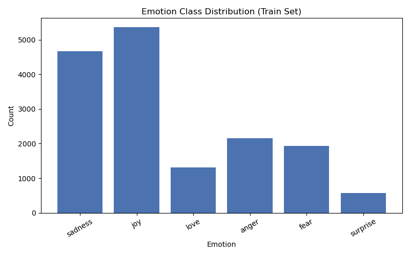
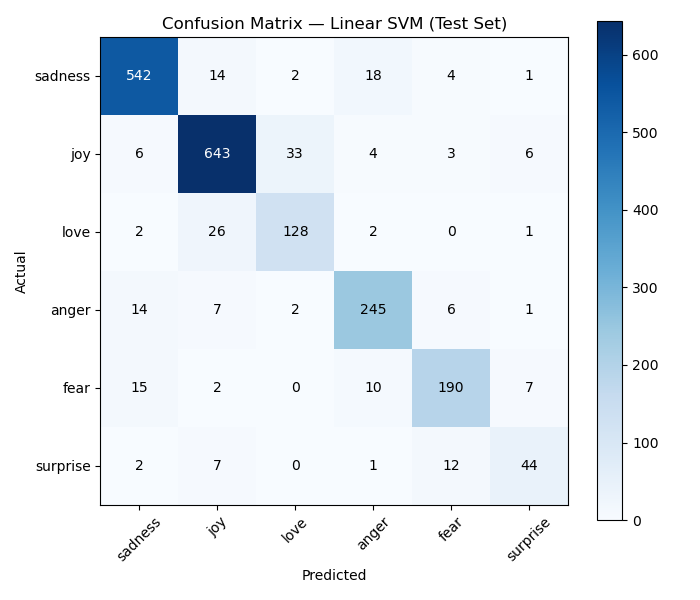

# Emotion Detection from Text (NLP)


A machine learning system that classifies text into one of six emotions — sadness, joy, love, anger, fear, surprise — using a TF-IDF + Linear SVM pipeline. Built as a complete, reproducible NLP project: data exploration, preprocessing, model comparison, evaluation, and a live prediction interface.

## Overview

Given a sentence, the model predicts its dominant emotion along with a confidence score. Trained and evaluated on the `dair-ai/emotion` dataset (20,000 labeled tweets), achieving **89.6% test accuracy** and a **0.849 macro F1-score**.

## Features

- Full text preprocessing pipeline (cleaning, tokenization, stopword removal with negation-preservation, lemmatization)
- Empirical comparison of 3 classification models (Logistic Regression, Naive Bayes, Linear SVM)
- Evaluation using macro F1 (not just accuracy) to properly account for class imbalance
- Confidence-scored predictions via `CalibratedClassifierCV`
- Persisted, reusable model artifacts (`joblib`)
- Live interactive demo via Streamlit

## Tech Stack

Python · scikit-learn · NLTK · pandas · NumPy · matplotlib · Streamlit

## Project Structure

emotion-detection-nlp/
├── data/                    # dataset (loaded via Hugging Face datasets)
├── src/
│   ├── data_loader.py        # dataset loading
│   ├── eda.py                 # exploratory data analysis
│   ├── preprocessing.py       # text cleaning pipeline
│   ├── features.py             # TF-IDF feature engineering
│   ├── train.py                 # model comparison (Phase 6)
│   ├── train_final.py           # final model training + persistence
│   ├── evaluate.py               # test-set evaluation + confusion matrix
│   └── predict.py                 # prediction system
├── models/                   # saved model + vectorizer (.pkl)
├── reports/
│   ├── figures/                # saved plots
│   ├── REPORT.md                # full project report
│   └── INTERVIEW_PREP.md        # technical + viva Q&A
├── app.py                    # Streamlit live demo
└── requirements.txt

## Dataset

[`dair-ai/emotion`](https://huggingface.co/datasets/dair-ai/emotion) — 16,000 train / 2,000 validation / 2,000 test tweets, labeled with 6 emotions. Notably imbalanced: joy (5,362 examples) outnumbers surprise (572) by ~9.4x — a factor that directly shaped the evaluation approach below.



## Approach

1. **Preprocessing:** lowercasing, URL/HTML/special-character removal, tokenization, stopword removal (negation words deliberately preserved), lemmatization
2. **Feature engineering:** TF-IDF (max 5,000 features), fit on training data only to prevent leakage
3. **Model selection:** compared Logistic Regression, Multinomial Naive Bayes, and Linear SVM on validation data
4. **Final model:** Linear SVM wrapped in `CalibratedClassifierCV` for confidence scores

## Results

| Model | Accuracy | Macro F1 |
|---|---|---|
| Logistic Regression | 0.877 | 0.837 |
| Multinomial Naive Bayes | 0.747 | 0.571 |
| **Linear SVM (selected)** | **0.902** | **0.873** |

**Test set (final model):** 89.6% accuracy, 0.849 macro F1



Two notable, explainable confusion patterns: **Love↔Joy** (overlapping positive-valence vocabulary) and **Surprise→Fear** (overlapping high-arousal vocabulary, compounded by surprise's small sample size). Full analysis in [`reports/REPORT.md`](reports/REPORT.md).

## Installation

```bash
git clone https://github.com/Rudra01a/emotion-detection-nlp.git
cd emotion-detection-nlp
python -m venv venv
source venv/bin/activate        # Windows: venv\Scripts\activate
pip install -r requirements.txt
```

## Usage

```bash
python src/train_final.py     # train and save the model (one-time)
python src/predict.py          # run predictions on sample sentences
streamlit run app.py            # launch the interactive demo
```

## Live Demo

_Link added after Streamlit Cloud deployment (Phase 13)._

## Limitations & Future Improvements

- Class imbalance still measurably affects minority-class performance (surprise, love) — future work: oversampling or class-weighted loss
- TF-IDF has no concept of word order; a transformer-based model (e.g. DistilBERT) would better capture context and negation
- Training data's short, direct tweet style limits generalization to naturally-phrased sentences — see [`reports/REPORT.md`](reports/REPORT.md) for full discussion

## Documentation

- [Full Project Report](reports/REPORT.md)

## Author
Rudra Pratap Singh